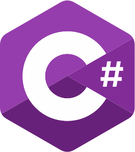
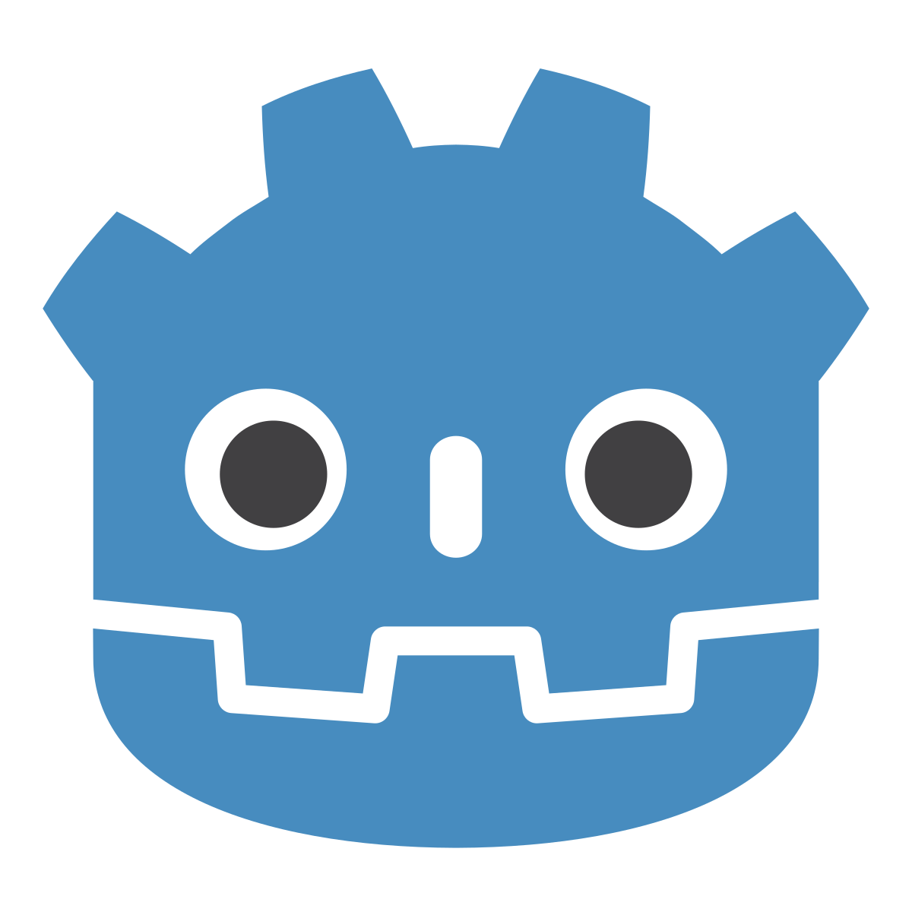
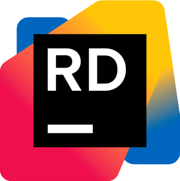
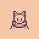

## Hello!
I'm Nima Darooei (PixelHole) 
- 🖥 Software engineer
- 👾Game designer
- 🖌 Artist

🎯Interested in both Game design and Software development  
🔭 Currently maintaining [Chip-13](https://pixelhole.itch.io/chippie)  
🌱 I’m learning Godot and GDscript  
👯 Open to any collaborations regarding Design, development or engineering

## ✨Skills

[//]: # ([]&#40;https://www.jetbrains.com/rider/&#41;)

## 🔨Projects I've worked on

### 🪛Additional projects
- [Simple FTP Service](https://github.com/PixelHole/FTP-Service)
- [Formal Language Parser](https://github.com/PixelHole/FormalLanguageParser)

## 📫Socials
- Discord : pixeldhole
- Telegram : [Nima Darooei](https://t.me/Nimadaloo)
- Email : Pixelholeofficial@gmail.com